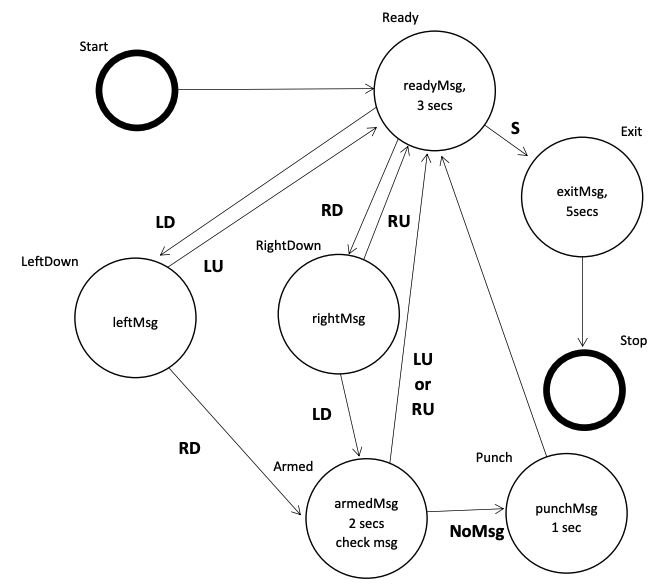

# QNX Real-Time State Machine
State machine build in QNX real-time operating system. This state machine demonstrates multi-threading, namespaces, timers, and IPC using a pulse.

## Build Environment
- QNX Software Development Platform version 7.0
- QNX SDP 7.0 x86-64 virtual machine
- VMware Workstation Player 12.0

## Date Created
November, 2018

## Author
Nathan Festoso
